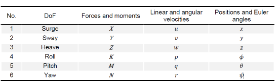

# Line Follower BlueROV2

## Ambiente

* Oracle VM VirtualBox
* Ubuntu 20.04.4
* Ros Noetic
* Gazebo 11.12.0
* UUV Simulator

### Introduzione

Il progetto in questione consiste nell' implementazione di un algoritmo di **line following** in ambiente subacqueo tramite il veicolo **BlueROV2** della BlueRobotics. L' idea e' quella di raggiungere tale obiettivo tramite un algoritmo di visione artificiale in grado di rilevare l' errore di orientamento del veicolo rispetto alla retta di riferimento e calcolare dei riferimenti di velocita' angolare da inviare al robot al fine di mantenere tale errore nullo.

#### BlueROV2 e modellazione matematica

##### ROV

Un **ROV (Remotely Operated underwater Vehicle)** e' un veicolo subacqueo comandato a distanza, noto anche come drone sottomarino. I ROV possono ispezionare il mondo subacqueo anche a profondita' maggiori rispetto ai cento metri.
In genere sono costituiti da un certo numero di **thruster** che permettono il moto del veicolo e da una **telecamera** posta generalmente nella parte frontale.

Una delle applicazioni nelle quali i ROV trovano utilizzo e nell'_ispezione e riparazione di oleodotti e condutture subacquee_.


In tali contesti infatti risultano necessarie regolari ispezioni e eventuali riparazioni per evitare perdite e garantire una maggiore efficienza e sicurezza per le aree circostanti.
In genere l'operazione avviene tramite comandi impartiti dall'utente a distanza. Tuttavia potrebbe essere utile gestire l'operazione tramite un _sistema di controllo_ in grado di ispezionare tali condutture in modo autonomo.

##### Bluerov2

Il **BlueROV2** e' un ROV  subacqueo prodotto dalla _BlueRobotics_. E' dotato in tutto di 6 thruster T200 (2 orizzontali e 4 verticali) che permettono il controllo a 6 gradi di liberta' del veicolo.


##### Modellazione matematica di un veicolo sottomarino

La modellazione matematica di un ROV e' descritta dalle **equazioni di Fossen** (_Handbook of marine craft hydrodynamics and motion control, Fossen, 2011_).
Per convenzione viene utilizzata la notazione SNAME riportata nella seguente tabella:



Per quello che riguarda la cinematica del veicolo vengono considerati due frame di riferimento:

* NED (Nord East Down) con coordinate $(x_n,y_n,z_n)$
* BODY il frame solidale al veicolo con coordinate $(x_b,y_b,z_b)$

Il frame NED si riferisce al frame del mondo in cui l'asse x punta verso il nord, l'asse y punta verso l'est e l'asse z verso il basso mentre il frame BODY e' il frame solidale al veicolo ed ha origine nel baricentro del ROV, asse x lungo l'asse di simmetria logitudinale del veicolo, asse y verso la destra del veicolo e asse z rivolto verso il basso.

Per effettuare il cambio di coordinate da un frame ad un altro e' necessarioutilizzare delle _matrici di rotazione_. In particolare dati gli angoli di Eulero che definiscono gli angoli di rotazione dei tre assi $(\phi ,\theta,\psi)$, la trasformazione dal frame BODY {b} al frane NED {n} e' data da:

$$v^n= R_b^N(\Theta) v^b$$

dove la matrice di rotazione $R_b^n(\Theta)$ e' rappresentata da:


In modo simile la trasformazione delle velocita' angolari e' data dalla seguente: 

$$\dot{\Theta}=T(\Theta)\omega^b $$

dove $\omega^b $ e $\dot{\Theta}$ sono le velocita' angolari rispetto al BODY frame e rispetto al NED frame rispettivamente.
La matrice di trasformazione e data da:


Le equazioni dinamiche del moto del ROV invece si ricavano a partire dalla formulazione di Newton Eulero:
$$ M\dot{v}+C(v)v +D(v)+g(\eta)=\tau$$
dove $M$ e la matrice di inerzia del sistema,$C(v)$ rappresenta la matrice di Coriolis, $D(v)$ e' la matrice di smorzamento idrodinamico, $g(\eta)$ e' il vettore delle forze gravitazionali e di galleggiamento e $\tau$ e' il vettore delle forze e dei momenti esterni agenti sul ROV, mentre $v$ e' il vettore delle velocita' del veicolo rispetto al frame BODY.
Le equazioni dimaniche che descrivono il moto del ROV sono descritte dalle seguenti:

$$ \dot{\eta}=J(\eta)v \\
M\dot{v}+C(v)v +D(v)+g(\eta)=\tau$$
dove la prima equazione descrive la cinematica del veicolo, ovvero descrive il moto del ROV in termini di reappresentazioni in differenti frame di riferimento mentre la seconda descrive le forze e i momenti che inducono il moto del ROV.

##### Thruster

Il vettore $\tau$ rappresenta il vettore delle forze e dei momenti esterni agenti sul baricentro del veicolo e puo' essere rappresentato come:
$$ \tau = [F_x,F_y,F_z,M_x,M_y,M_z]'$$
Le forze in questione dovranno essere generate a partire dai 6 thruster presenti sul veicolo che tramite la rotazione delle eliche genereranno una spinta $F$ proporzionale alla velocita' di rotazione. Indicando con $F_i$ la spinta generata dal thruster $i$-esimo e' possibile costruire il vettore di comando $F_{thr}$ come:
$$ F_{thr} =\left[ F_1,F_2,F_3,F_4,F_5,F_6\right]'$$
E' possibile pertanto scrivere la seguente relazione:

$$\tau = T_{}(\alpha)F_{thr}$$

dove la matrice $T(\alpha)=[t_1,t_2,t_3,t_4,t_5,t_6]\in \R^{6x6},$ e' la matrice di allocazione dei thruster e permette di converire il vettore delle forze agenti sul baricentro del veicolo nel vettore di comando da fornire a ciascun thruster e $\alpha$ rappresenta il vettore di rotazione angolare di ciascun thruster. il generico elemento $t_i$ puo' essere calcolato a partire dalla configurazione dei thruster.

## UUV Simulator

L' **Unmanned Underwater Vehicle Simulator** e' costituito da un set di package che includono Gazebo plugins e moduli ROS per la simulazione di veicoli subacquei.

Tra le varie caratteristiche si ha:

* L'implementazione delle **equazioni del moto di Fossen** per veicoli subacquei che descrivono il moto di un veicolo sottomarino, in particolare la cinematica e la dinamica
* Plugin e moduli per la simulazione dei thruster
* Simulazione di modelli 3D per la velocita' della corrente
* Plugin per i sensori
* Modellazione di monfi subaquei.

### Installazione

Attualmente UUV Simulator e' rilasciata solo per le distribuzioni ROS kinetic,lunar e melodic. Per l' installazione con la versione Noetic e' stato necessario installare il branch specifico "noetic". In particolare e' stato clonato il repository githube successivamente viene selezionato il branch specifico "noetic":

```bash

git clone https://github.com/arturmiller/uuv_simulator/tree/noetic
$ git checkout noetic
```

#### Underwater object plugin

Il moto del veicolo viene simulato grazie al **UnderwaterObjectPlugin** che implementa le equazioni di Fossen che descrivono il moto di un veicolo sottomarino.
Il plugin deve essere inserito all' interno del file `.xacro` che contiene la descrizione del veicolo e devono essere specificate alcuni parametri necessari alla simulazione del veicolo in acqua, come la densita' dell'acqua, il topic sul quale viene pubblicata la velocita' della corrente e il modello idrodinamico del robot.

```xml
      <plugin name="uuv_plugin" filename="libuuv_underwater_object_ros_plugin.so">
        <fluid_density>1028.0</fluid_density>
        <flow_velocity_topic>hydrodynamics/current_velocity</flow_velocity_topic>
        <debug>$(arg debug)</debug>
        <!-- Adding the hydrodynamic and hydrostatic parameters for the vehicle -->
        <xacro:bluerov2_hydro_model namespace="$(arg namespace)"/>
      </plugin>
```

Il modello idrodinamico viene a sua volta definito nel file `gazebo.xacro`, riportato di seguito.

```xml
  <xacro:macro name="bluerov2_hydro_model" params="namespace">
    <!-- List of hydrodynamic models this robot's links -->
    <link name="${namespace}/base_link">
      <!-- This flag will make the link neutrally buoyant -->
      <neutrally_buoyant>0</neutrally_buoyant>
      <!-- Link's volume -->
      <volume>${volume}</volume>
      <!-- Link's bounding box, it is used to recalculate the immersed volume when close to the surface.-->
      <box>
        <width>${x_size}</width>
        <length>${y_size}</length>
        <height>${z_size}</height>
      </box>
      <!-- Center of buoyancy -->
      <center_of_buoyancy>${cob}</center_of_buoyancy>
      <!-- Fossen's equation of motion for underwater vehicles -->
      <hydrodynamic_model>
          <type>fossen</type>
          <!-- Added mass: see p.28 in Berg2012 -->
          <added_mass>
            1.7182 0 0 0 0 0
            0 0 0 0 0 0
            0 0 5.468 0 0 0
            0 0 0 0 0 0
            0 0 0 0 1.2481 0
            0 0 0 0 0 0.4006
          </added_mass>
          <!--
            The linear damping coefficients can be provided as a diagonal (6 elements)
            or a full matrix (36 coefficients), like the added-mass coefficients above
            Linear damping: see p.31 in Berg2012
          -->
          <linear_damping>
            -11.7391 -20 -31.8678 -25 -44.9085 -5
          </linear_damping>
          <quadratic_damping>
            0 0 0 0 0 0
          </quadratic_damping>
      </hydrodynamic_model>
```

##### Thruster Plugin

Il **Thruster Plugin** permette di simulare la dinamica del thruster e implementa la relazione tra la velocita' angolare del veicolo e la spinta generata in output. Questo viene reso possibile grazie all'utilizzo di due tag: _<dynamic_model>_ e _<conversion_function>_.

Il primo implementa la **dinamica del thruster**, ovvero la relazione tra l'input del thruster e la velocita' di rotazione del thruster. Esistono diversi modelli messi a disposizione, ma nel caso specifico e' stato utilizzato il modello `FirstOrder` con constante di tempo pari a 0.2.
Il secondo modulo invece implementa la **funzione di conversione**, ovvero la relazione tra la velocita' del rotore e la spinta generata in output. Anche in questo caso vengono messi a dispozione diversi modelli, in questo caso e' stato utilizzato il modello `Basic`, che approssima tale relazione ad una relazione proporzionale.
Nella figura seguente vengono riportati i modelli `FirstOrder` a sinistra e `Basic` a destra.


Il plugin Gazebo in questo caso va specificato nel tag `<gazebo>` della macro del thruster che si trova ne file `snippets.xacro`.

```xml
  <xacro:macro name="thruster_macro" params="robot_namespace thruster_id *origin">
    <link name="${robot_namespace}/thruster_${thruster_id}">
      <visual>
        <geometry>
          <mesh filename="${prop_mesh_file}" scale="1 1 1" />
        </geometry>
      </visual>
      <inertial>
        <mass value="0.010" />
        <origin xyz="0 0 0" rpy="0 0 0"/>
        <inertia ixx="0.000000017" ixy="0.0" ixz="0.0"
               iyy="0.000000017" iyz="0.0"
               izz="0.000000017" />
      </inertial>
    </link>
    <!-- Joint between thruster link and vehicle base link -->
    <joint name="${robot_namespace}/thruster_${thruster_id}_joint" type="continuous">
      <xacro:insert_block name="origin" />
      <axis xyz="1 0 0" />
      <parent link="${robot_namespace}/base_link" />
      <child link="${robot_namespace}/thruster_${thruster_id}" />
    </joint>

    <!-- Gazebo ThrusterPlugin-->
    <gazebo>
      <!-- Thruster ROS plugin -->
     <plugin name="${robot_namespace}_${thruster_id}_thruster_model" filename="libuuv_thruster_ros_plugin.so">
       <!-- Name of the thruster link -->
       <linkName>${robot_namespace}/thruster_${thruster_id}</linkName>
       <!-- Name of the joint between thruster and vehicle base link -->
       <jointName>${robot_namespace}/thruster_${thruster_id}_joint</jointName>
       <!-- Make the thruster aware of its id -->
       <thrusterID>${thruster_id}</thrusterID>
       <!-- Gain of the input command signal -->
       <gain>1</gain>
       <!--
       Value from 0 to 1 to set the efficiency of the output thrust force
       Default value is 1.0
       -->
       <thrust_efficiency>1</thrust_efficiency>
       <!--
       Value from 0 to 1 to set the efficiency of the propeller as a factor
       to be multiplied to the current value of the state variable at each
       iteration.
       Default value is 1.0
       -->
       <propeller_efficiency>1</propeller_efficiency>

       <!-- 2) First order model -->
       <dynamics>
         <type>FirstOrder</type>
         <timeConstant>0.2</timeConstant>
       </dynamics>

       <conversion>
         <type>Basic</type>
         <rotorConstant>0.0001</rotorConstant>
         <!-- <rotorConstant>0</rotorConstant> -->
       </conversion>

     </plugin>
   </gazebo>
    <gazebo reference="${robot_namespace}/thruster_${thruster_id}">
      <selfCollide>false</selfCollide>
    </gazebo>

  </xacro:macro>

```

#### Thruster manager

Il simulatore consente inoltre la generazione automatica della **matrice di allocazione** o **TAM (Thruster Allocation Matrix)**. Questo viene reso possibile grazie al package `uuv_thruster_manager` che permette di generare automaticamente la TAM e converte il vettore delle forze di comando in spinte per i singoli thruster.
Tramite il comando:

```bash
rosrun uuv_assistants create_thruster_manager_configuration --robot_name <'bluerov2'>
```

e' possibile generare un nuovo package per la configurazione del thruster manager con all' interno il file di configurazione `thuster_manager.yaml` che dovra' essere opportunamente modificato in base alle caratteristiche del thruster utilizzato. Di seguito si riporta il contenuto del file `thruster_manager.yaml`.
```yaml
thruster_manager:
  tf_prefix: bluerov2
  base_link: base_link
  thruster_topic_prefix: thrusters/
  thruster_topic_suffix: /input
  thruster_frame_base: thruster_
  max_thrust: 1520.0
  timeout: -1
  update_rate: 10
  ##################################################
  # Thruster Model
  ##################################################
  # Conversion function :
  conversion_fcn: proportional
  conversion_fcn_params:
    gain: 0.026546960744430276 
```

Inoltre sempre all'interno di tale package e' presente un file `start_thruster_manager.launch` che genera la matrice di allocazione, la salva nel file `tam.yaml` e avvia il nodo `thruster_manager` che permette la conversione del vettore delle forze sul veicolo **$\tau$** in spinte da generare su ciascun thruster **$F_{thr}$**.

## Modello gazebo per BlueROV2

Per la simulazione del modello Gazebo del BlueROV2 e' stato utilizzato il modello fornito dal package **`bluerov2_description`** creato tramite le utility messe a disposizione da UUV Simulator.

```bash
git clone https://github.com/FletcherFT/bluerov2.git
```

All' interno della directory vengono messe a disposizione una serie di package per la simulazione e il controllo del BlueROV2. 
Ai fini del progetto tuttavia sono stati utili solo due pacchetti, in particolare **bluerov2_description** e **bluerov2_control**. Entrambi i packege sono stati generati a partire dagli script di UUV simulator: il primo tramite `create_new_vehicle`, il secondo  `create_thruster_manager`.

### Bluerov2_description

Il package **bluerov2_description** contiene gli `urdf` per la creazione del modello e il file launch per lo spawn del veicolo nel mondo Gazebo.
Nella directory **urdf** sono presenti i file:

* `snippets.xacro`
* `actuators.xacro`
* `sensors.xacro`
* `base.xacro`
* `gazebo.xacro`

Nel file `snippets.xacro` sono state definite tutte le xacro dei vari componeti del sistema ovvero la macro del thruster e la xacro della camera. Si riportano le definizioni delle due
xacro di interesse:

```xml
<xacro:property name="prop_mesh_file" value="file://$(find bluerov2_description)/meshes/bluerov2_propcw.dae"/>
  <!--
    Thruster macro with integration of joint and link. The thrusters should
    be initialized in the actuators.xacro file.
  -->
  <xacro:macro name="thruster_macro" params="robot_namespace thruster_id *origin">
    <!--
    Dummy link as place holder for the thruster frame,
    since thrusters can often be inside the collision geometry
    of the vehicle and may cause internal collisions if set otherwise
    -->
    <link name="${robot_namespace}/thruster_${thruster_id}">

      <visual>
        <geometry>
          <mesh filename="${prop_mesh_file}" scale="1 1 1" />
        </geometry>
      </visual>

      <inertial>
        <mass value="0.010" />
        <origin xyz="0 0 0" rpy="0 0 0"/>
        <inertia ixx="0.000000017" ixy="0.0" ixz="0.0"
               iyy="0.000000017" iyz="0.0"
               izz="0.000000017" />
      </inertial>
    </link>

    <!-- Joint between thruster link and vehicle base link -->
    <joint name="${robot_namespace}/thruster_${thruster_id}_joint" type="continuous">
      <xacro:insert_block name="origin" />
      <axis xyz="1 0 0" />
      <parent link="${robot_namespace}/base_link" />
      <child link="${robot_namespace}/thruster_${thruster_id}" />
    </joint>

    <!-- From desistek underwater vehicle -->
    <gazebo>
      <!-- Thruster ROS plugin -->
     <plugin name="${robot_namespace}_${thruster_id}_thruster_model" filename="libuuv_thruster_ros_plugin.so">
       <!-- Name of the thruster link -->
       <linkName>${robot_namespace}/thruster_${thruster_id}</linkName>
       <!-- Name of the joint between thruster and vehicle base link -->
       <jointName>${robot_namespace}/thruster_${thruster_id}_joint</jointName>
       <!-- Make the thruster aware of its id -->
       <thrusterID>${thruster_id}</thrusterID>
       <!-- Gain of the input command signal -->
       <gain>1</gain>
       <!--
       Value from 0 to 1 to set the efficiency of the output thrust force
       Default value is 1.0
       -->
       <thrust_efficiency>1</thrust_efficiency>
       <!--
       Value from 0 to 1 to set the efficiency of the propeller as a factor
       to be multiplied to the current value of the state variable at each
       iteration.
       Default value is 1.0
       -->
       <propeller_efficiency>1</propeller_efficiency>

       <!-- 2) First order model -->
       <dynamics>
         <type>FirstOrder</type>
         <timeConstant>0.2</timeConstant>
       </dynamics>

       <conversion>
         <type>Basic</type>
         <rotorConstant>0.0001</rotorConstant>
         <!-- <rotorConstant>0</rotorConstant> -->
       </conversion>

     </plugin>
   </gazebo>

    <gazebo reference="${robot_namespace}/thruster_${thruster_id}">
      <selfCollide>false</selfCollide>
    </gazebo>

  </xacro:macro>

  <xacro:macro name="bluerov_camera" params="namespace parent_link suffix *origin">
    <xacro:regular_camera_plugin_macro
      namespace="${namespace}"
      suffix="${suffix}"
      parent_link="${parent_link}"
      topic="camera"
      mass="0.001"
      update_rate="30"
      hfov="1.5125"
      width="1920"
      height="1080"
      stddev="0.01"
      scale="1.0">
      <inertia ixx="0.00001" ixy="0.0" ixz="0.0" iyy="0.00001" iyz="0.0" izz="0.00001" />
      <xacro:insert_block name="origin" />
    </xacro:regular_camera_plugin_macro>
  </xacro:macro>
```

Nel file `actuator.xacro` vengono aggiunte le 6 unita' dei thruster.

```xml
  <!-- Thruster0 -->
  <xacro:thruster_macro robot_namespace="${namespace}" thruster_id="0">
    <origin xyz="0.1355 -0.1 -0.0725" rpy="0 0 0.7853981634"/>
  </xacro:thruster_macro>
  <!-- Thruster1 -->
  <xacro:thruster_macro robot_namespace="${namespace}" thruster_id="1">
    <origin xyz="0.1355 0.1 -0.0725" rpy="0 0 -0.7853981634"/>
  </xacro:thruster_macro>
  <!-- Thruster2 -->
  <xacro:thruster_macro robot_namespace="${namespace}" thruster_id="2">
    <origin xyz="-0.1475 -0.1 -0.0725" rpy="0 0 2.3561944902"/>
  </xacro:thruster_macro>
  <!-- Thruster3 -->
  <xacro:thruster_macro robot_namespace="${namespace}" thruster_id="3">
    <origin xyz="-0.1475 0.1 -0.0725" rpy="0 0 -2.3561944902"/>
  </xacro:thruster_macro>
  <!-- Thruster4 -->
  <xacro:thruster_macro robot_namespace="${namespace}" thruster_id="4">
    <origin xyz="0.0025 -0.1105 -0.005" rpy="0 -1.5707963268 0"/>
  </xacro:thruster_macro>
  <!-- Thruster5 -->
  <xacro:thruster_macro robot_namespace="${namespace}" thruster_id="5">
    <origin xyz="0.0025 0.1105 -0.005" rpy="0 -1.5707963268 0"/>
  </xacro:thruster_macro>
  
  ```

  

Nel file `sensor.xacro` vengono aggiunti i sensori del veicolo, nel caso specifico sono stati utilizzati un sensore del tipo "Pose 3D" messo a disposizione dal simulatore e che fornisce la posa del veicolo in 3D rispetto al frame world e una telecamera RGB.
Nel caso specifico la camera e' stata ruotata di $45^\circ$ verso il basso in modo tale da poter osservare la tubatura sotto il veicolo.

```xml

  <!-- Mount a Pose 3D sensor. -->
  <xacro:default_pose_3d namespace="${namespace}" parent_link="${namespace}/base_link" />
  
  <!-- Mount a camera -->
  <xacro:bluerov_camera namespace="" parent_link="${namespace}/base_link" suffix="_front">
    <origin xyz="0.2 0 0" rpy="0 ${pi/4} 0"/>
  </xacro:bluerov_camera>
  
  ```

Nel file `gazebo.xacro` viene definito il modello idrodinamico del bluerov e infine nel file `base.xacro` viene definita la macro del bluerov, _bluerov2_base_, in cui vengono inclusi anche i file `sensor.xacro` e `actuator.xacro`.
Il file `base.xacro` e `gazebo.xacro` vengono poi inclusi nel file   `default.xacro` nel quale poi viene specificato il plugin **UnderWaterObject** che permette la simulazione delle equazioni di Fossen.

Nella directory **launch** invece e' presente il file `upload.launch` che avvia lo spawn del modello del robot definito nel file `default.xacro`.


#### Bluerov2_control

Il package **bluerov2_control** invece contiene i file per la generazione della matrice di allocazione e il file launch per l' avvio del thruster manager.
All'interno di tale package sono stati poi aggiunti i nodi necessari all' implementazione dell' algoritmo di line following.

La logica di controllo prevede l'implementazione di due loop di controllo come mostrato in figura:


Il loop interno implementa un **controllo sulla velocita del veicolo**, in particolare sulla velocita' di traslazione lungo l'asse x $v_x$ e lungo l'asse z $v_z$ e sulla velocita' angolare su z $\omega_z$.
Il loop piu' esterno invece implementa la parte di **visione artificiale** e calcola a partire dall'errore lineare $e_x$ e angolare  $e_\theta$ i valori di velocita' da fornire al robot.

##### Controllo di velocita' del ROV

Il primo passo al fine di poter eseguire il line following e' quello di implementare un **controllo di velocita'**.
Al fine di poter comandare il BlueROV e' necessario fornire in input le spinte che i singoli thruster devono generare in modo tale da permettere la traslazione e la rotazione lungo i tre assi.
Il generico thruster $i$ genera una spinta $F_i$. Quindi il BlueROV riceve in input il vettore $[F_0,F_1,F_2,F_3,F_4,F_5]$.

Tuttavia grazie al `thruster_manager` e' possibile generare la matrice di allocazione e convertire le forze e le coppie agenti sul centro di gravita' del veicolo $[F_x,F_y,F_z,M_x,M_y,M_z]^T$ in spinte di ciascun thruster $[T_0,T_1,T_2,T_3,T_4,T_5]$.

Nel caso specifico tuttavia non e' stato necessario implementare un controllo di velocita' per tutti e 6 i gdl ma e' stato sufficiente implementare il controllo sulla velocita' di traslazione lungo l'asse x $v_x$ e lungo l'asse z $v_z$ e la velocita di rotazione rispetto all'asse x ${\omega}_z$ come mostrato in figura:


In particolare la posa del veicolo viene misurata dall'unita' **"Pose 3D** installata sul veicolo. Questa unita' installata sul veicolo fornisce la posa rispetto al frame NED del mondo.
Al fine di poter implementare il controllo di velocita' e' stato necessario implementare il nodo `world_to_body` che permette la conversione delle coordinate dal frame di riferimento NED al frame di riferimento body, solidale al corpo.

Il nodo `world_to_body.py` legge la velocita' del veicolo rispetto al frame world dal topic **`/bluerov2/pose_gt`** ed effettua la trasformazione di coordinate pubblicando la velocita' calcolata rispetto al frame solidale al veicolo sul topic **`/bluerov2/pose_body`**.
Di seguito viene riportato il codice che implementa la relazione:

``` python
#!/usr/bin/env python3
from nav_msgs.msg import Odometry
from geometry_msgs.msg import Twist,Quaternion,Pose 
import rospy
import numpy as np
import conversion_w_to_b as conv 
import tf
import math


class world_to_body_transform:
  def __init__(self):
    rospy.init_node('world_to_body')
    # ------- PARAMETERS ------- 
    self.freq = 1/rospy.get_param('/gazebo/time_step', 0.01)
    self.rate = rospy.Rate(self.freq)

    # -------   TOPICS   -------
    self.vel_word_sub = rospy.Subscriber('bluerov2/pose_gt',Odometry,self.vel_world_callback)
    self.vel_body_pub = rospy.Publisher('/bluerov2/pose_body',Odometry,queue_size=1)

  # -------   LIFE CYCLE   -------
  def loop(self):
    rospy.spin()

  # -------   CALLBACK   -------
  def vel_world_callback(self, msg):
    vel_body = conv.ConversionW2B(msg)
    # Pubblicazione sul topic 
    self.vel_body_pub.publish(vel_body)

# -------   INITIALIZE INSTANCE  -------
if __name__ == '__main__':
  node = world_to_body_transform
  node.loop()
```

Dove la funzione ConversionW2B e' definita nel file `conversion_w_to_b.py` riportato di seguito:

``` python
#!/usr/bin/env python3

from nav_msgs.msg import Odometry
from geometry_msgs.msg import Twist,Quaternion,Pose 
import rospy
import numpy as np
import tf
import math

def ConversionW2B(pose_gt):

    pose_w = pose_gt.pose.pose
    vel_w = pose_gt.twist.twist 
    #conversione da quaternioni in angoli di eulero
    quaternion =(pose_w.orientation.x,pose_w.orientation.y,pose_w.orientation.z,pose_w.orientation.w)
    euler = tf.transformations.euler_from_quaternion(quaternion)
    [roll, pitch, yaw] = [euler[0], euler[1],euler[2]]
        
    # Calcolo della matrice di rotazione dal frame body al frame world
    R = np.array([[math.cos(yaw)*math.cos(pitch), -math.sin(yaw)*math.cos(roll)+math.cos(yaw)*math.sin(pitch)*math.sin(roll), math.sin(yaw)*math.sin(roll)+math.cos(yaw)*math.cos(roll)*math.cos(pitch)],[math.sin(yaw)*math.cos(pitch), math.cos(yaw)*math.cos(roll)+math.sin(roll)*math.sin(pitch)*math.sin(yaw),- math.cos(yaw)*math.sin(roll)+math.sin(pitch)*math.sin(yaw)*math.cos(roll)],[-math.sin(pitch), math.cos(pitch)*math.sin(roll), math.cos(pitch)*math.cos(roll)]])

    # Matrice di trasformazione angolare dal frame body al frame world
    T = np.array([[1,math.sin(roll)*math.tan(pitch),math.cos(roll)*math.tan(pitch)],[0,math.cos(roll),-math.sin(roll)],[0, math.sin(roll)/math.cos(pitch),math.cos(roll)/math.cos(pitch)]])
        
    # Matrice di trasformazione delle velocita` dal frame world a body`
    R_1 = np.linalg.inv(R)
    T_1 = np.linalg.inv(T)
    # calcolo velocita` nel frame body

    # vettore delle velocita` lineari
    vel_l_world_array = np.array([vel_w.linear.x,vel_w.linear.y,vel_w.linear.z])

    # vettore delle velocita` angolari
    vel_a_world_array = np.array([vel_w.angular.x,vel_w.angular.y,vel_w.angular.z])
    vel_l_body = np.dot(R_1,vel_l_world_array)
    vel_a_body = np.dot(T_1,vel_a_world_array)

    vel_body = Odometry()
    vel_body.twist.twist.linear.x = vel_l_body[0]
    vel_body.twist.twist.linear.y = vel_l_body[1]
    vel_body.twist.twist.linear.z = vel_l_body[2]

    vel_body.twist.twist.angular.x = vel_a_body[0]
    vel_body.twist.twist.angular.y = vel_a_body[1]
    vel_body.twist.twist.angular.z = vel_a_body[2]
    return vel_body

```

A questo punto tale velocita' viene utilizzata per eseguire un controllo di velocita'.
Il controllo di velocita' e' implementato nel nodo `velocity_pid_controller.py`. Il nodo in questione si occupa di implemntare la logica di controllo. In particolare il controllo viene eseguito tramite un PI  per $v_x$ e $\omega_z$ e un PID per il controllo di $v_z$.
Il nodo genera tre oggetti di tipo PID per ciascun regolatore, legge la velocita' del veicolo dal topic **`/bluerov2/pose_body`**, legge la velocita' di riferimento dal topic **`/bluerov2/cmd_vel`**, calcola l'azione di controllo attraverso il metodo `calulate` e pubblica la l'azione di comando da fornire al ROV sul topic **`/bluerov2/thruster_manager/input`** che poi verra' trasformata in spinte per ciascun thruster dal nodo `thruster_manager.py`.

```python
#!/usr/bin/env python3
from uuv_gazebo_ros_plugins_msgs.msg import FloatStamped
from geometry_msgs.msg import Wrench
from geometry_msgs.msg import Vector3,Twist
from nav_msgs.msg import Odometry

import PID
import rospy

class VelocityPIDController:


    def __init__(self):
        rospy.init_node('velo_PID_controller')
    # ------- PARAMETERS ------- 
        self.freq = rospy.get_param('/gazebo/freq', 100)
        self.rate = rospy.Rate(self.freq)
        self.Tc = 0.01

        # PID Controller
        self.pid_surge = PID.PID(2033,653,0,self.Tc,3100)
        self.pid_heave = PID.PID(145000,1100,3110,self.Tc,3000)
        self.pid_yaw = PID.PID(930,583,0,self.Tc,1040)

        # Velocita letta
        self.v_meas = Twist()

        # Velocita` di riferimento
        self.v_ref = Twist()

    # -------   TOPICS   -------
        rospy.Subscriber('bluerov2/pose_body',Odometry,self.read_pose_callback)
        self.writer_thruster_pub = rospy.Publisher('/bluerov2/thruster_manager/input',Wrench,queue_size=1)
        rospy.Subscriber('/bluerov2/cmd_vel',Twist,self.cmd_vel_callback)

    # -------   LIFE CYCLE   -------
    def loop(self):
        while not rospy.is_shutdown():

            #  Calcolo dell' azione di controllo 
            input = Wrench()
            
            input.force.x = self.pid_surge.calculate(self.v_meas.linear.x,self.v_ref.linear.x)
            input.force.z = self.pid_heave.calculate(self.v_meas.linear.z,self.v_ref.linear.z)
            input.torque.z = self.pid_yaw.calculate(self.v_meas.angular.z,self.v_ref.angular.z)

            # Pubblicazione del messaggio sul topic
            self.writer_thruster_pub.publish(input)
            self.rate.sleep()

  # -------   CALLBACK   -------
    def read_pose_callback(self, msg):
        self.v_meas = msg.twist.twist
      

    def cmd_vel_callback(self,msg):
        self.v_ref = msg

# -------   INITIALIZE INSTANCE  -------
if __name__ == '__main__':
    node = VelocityPIDController()
    node.loop()
```

### Rilevamento tubatura e calcolo della retta


La seconda parte del progetto consiste nell'implementazione di un algoritmo in grado di rilevare la tubatura da inseguire dalle immagini provenienti dalla camera e di calcolare l' errore di orientamento dell'asse di simmetria longitudinale del veicolo rispetto alla retta.
Il sensore del quale viene dotato il ROV e' una camera RGB che permette di rilevare delle immagini RGB dell'ambiente.
In particolare la camera e' stata posta nella parte frontale del veicolo rivolta a $45^\circ$ verso il basso. Questo simula il comportamento del ROV reale, il quale e' dotato di una camera RGB in grado di ruotare tra $[-45^\circ,45^\circ]$ grazie ad un servo.
A partire da tale camera viene prelevata l'immagine RGB e viene elaborata al fine di rilevare l'**errore di orientamento** dell'asse di simmetria longitudinale del veicolo rispetto all'asse della tubatura.
L'idea e' quella di ricavare dall' immagine RGB della camera l'errore lineare $e_l$ e l'errore angolare $e_\theta$ come mostrato in figura.


Il nodo `line detect.py` implementa tale logica: a partire dall'immagine RGB letta dal topic della camera **`/bluerov2/camera_front/camera_image`** va a calcolare i due errori e li pubblica sul topic **`/bluerov2/line_error`** che e' un messaggio di tipo `Line_Error.msg`.

```python
# Line_Error.msg
float64 linear
float64 angular
bool rect_detected
```

L'immagine proveniente dal topic **`/bluerov2/camera_front/camera_image`** che ha dimensioni 1080x1920 viene ridimensionata e ritagliata. In particolare al fine dell'implementazione dell'algoritmo e' necessario e anche conveniente utilizzare solo la parte piu' bassa dell'immagine, poiche' e'quella piu' prossima al ROV.
A questo punto l'obiettivo e' quello di andare a ricavare i contorni della tubatura.
A tal fine viene rimosso il rumore tramite un filtro. In questo caso e' stato utilizzato un filtro Gaussiano specificando la dimensione del kernel e la deviazione rispetto a x e y.

```python
# Convert ROS image in OpenCV image
img_CV = self.bridge.imgmsg_to_cv2(msg,desired_encoding='passthrough')

#dim = (int(img_CV.shape[1]*0.6),(int(img_CV.shape[0]*0.6))
dim =(int(1920*0.6),int(1080*0.6))
img_BGR = cv2.resize(img_CV,dim,interpolation=cv2.INTER_AREA)

# Ridimensionamento e riduzione del rumore
img_RGB = cv2.cvtColor(img_BGR,cv2.COLOR_BGR2RGB)
img_RGB_copy = img_RGB.copy()
img_RGB =img_RGB[400:648,0:1152]
img_RGB = cv2.GaussianBlur(img_RGB,(5,5),0)
```

A questo punto e' possibile estrapolare il colore della tubatura dall'immagine ed utilizzarlo al fine di identificarne i **contorni**. In particolare si sceglie il range di valori RGB da voler estrapolare, si crea una maschera che permette di selezionare solo i pixel che siano inclusi in tale range e si effettua un'operazione bitwise and tra l'immagine RGB e la maschera calcolata. In questo modo e' possibile estrapolare il colore blu ed ottenere il risultato riportato in figura.


```python
# Creazione della maschera per la tubatura blu

blue_mask = cv2.inRange(img_RGB_copy,self.blue_lower,self.blue_upper)   
only_blue = cv2.bitwise_and(img_RGB_copy,img_RGB_copy, mask = blue_mask)     
```

A questo punto si utilizza l' immagine ricavata per rilevare i contorni della tubatura e tracciare il rettangolo contenente la tubatura. In particolare viene tracciato il rettangolo ad area minima che quindi sara' ruotato di un certo angolo.

```python
# Trovo i contorni dell' immagine 
contour,hierarchy = cv2.findContours(blue_mask.copy(),cv2.RETR_TREE,cv2.CHAIN_APPROX_SIMPLE)
if len(contour) > 0:
  # Calcolo del box minimo (ruotato) del primo contorno ricavato
  pipe_box = cv2.minAreaRect(contour[0])
# Disegno tutti i contorni (-1)
cv2.drawContours(img_RGB, contour, -1, (0,255,0), 3)
(x_cent,y_cent),(w_cent,h_cent),ang = pipe_box
```

E' importante osservare che il metodo `minAreaRect` restituisce le coordinate $(X,Y)$ dei quattro vertici del rettangolo ordinati in senso orario a partire dal vertice con la $Y$ piu' alta e se due vertici hanno la stessa $Y$ viene restituito il vertice piu' a destra. L'angolo che restituisce inoltre e' rappresentato dall'angolo tra il lato che congiunge il vertice iniziale e finale e l'asse orizzontale, come mostrato in figura.


Da cio' si puo' facilmente dedurre che il valore dell'angolo sara' sempre compreso tra $[0,90^\circ]$ e quindi e' necessaria una conversione al fine di poter avere un range di valori che va da $[-90^\circ,90^\circ]$

```python
# Conversione dell'angolo minAreaRect
if ang >= 45:
  ang = -90+ang
if w_cent < h_cent and ang < 0:
  ang = 90+ang
if w_cent > h_cent and ang > 0:
  ang = (-90+ang)
```


>
> #### :pushpin: Falsi positivi
>
> Il metodo `findContours` restituisce tutti i contorni degli elemnti identificati a partire dall'immagine binaria. Cio' significa che questo potrebbe identificare i contorni esterni, che non fanno parte della tubatura e identificare quindi dei **falsi positivi**. Il rischio in questo caso potrebbe essere quello che il veicolo identifichi tale elemento come tubatura e calcoli errore linare e angolare rispetto a tale elemento. Quindi il veicolo si sposterebe dalla traiettoria, rischiando di perdere di vista l'elemento di interesse.
> 
> L'idea e' quella di andare a fare una verifica su ciascun contorno identificato dal metodo `findContours`.
> Come gia' detto in precedenza per convenzione il metodo restituisce i contorni in senso orario partendo dal vertice che si trova nella parte piu' bassa dell'immagine. Quando ci si trova difronte allo scenario in cui sono presenti piu' rettangoli, quello che verra' utilizzato per l'inseguimento sara' quello piu' basso.
>
> ```python
> if len(contour) > 0:
>    if len(contour) == 1:
>       # Calcolo del box minimo (ruotato) del primo contorno ricavato
>        pipe_box = cv2.minAreaRect(contour[0])
>    else:
>       corners = []
>       for cont in range(len(contour)):
>         # Calcolo del box minimo (ruotato)
>         pipe_box_cont = cv2.minAreaRect(contour[cont])
>         # Calcolo dei vertici del rettangolo ricavato
>         pipe_box_cont = cv2.boxPoints(pipe_box_cont)
>         (x_box,y_box) = pipe_box_cont[0]
>         corners.append((y_box,cont))
>         # Ordino in modo decrescente
>         corners = sorted(corners,reverse=True)
>         (y_high,cont_high) = corners[0]
>         pipe_box = cv2.minAreaRect(contour[cont_high])
> ```
>
Di seguito viene riportato il codice completo.

```python
#!/usr/bin/env python3

from sensor_msgs.msg import Image 
import rospy
import numpy as np
import cv2, cv_bridge
from std_msgs.msg import Bool
from bluerov2_control.msg import Line_Error
import math


class LineDetect:
    def __init__(self):
        rospy.init_node('line_detector')
    # ------- PARAMETERS ------- 
        self.freq = 1/rospy.get_param('/gazebo/time_step', 0.1)
        self.rate = rospy.Rate(self.freq)
        self.bridge = cv_bridge.CvBridge()
        self.blue_upper = (255,50,50)
        self.blue_lower = (0,0,0)

    # -------   TOPICS   -------
        self.image_sub = rospy.Subscriber('/bluerov2/camera_front/camera_image',Image,self.image_callback)
        self.error_detect_pub = rospy.Publisher('/bluerov2/line_error',Line_Error,queue_size=1)

    # -------   LIFE CYCLE   -------
    def loop(self):
        rospy.spin()
  # -------   CALLBACK   -------
    def image_callback(self, msg):

        # Conversione dell'immagine ROV in formato OpenCV
        img_CV = self.bridge.imgmsg_to_cv2(msg,desired_encoding='passthrough')

        # Rimpicciolisco l'immagine del 60% delle sue dimensioni originali 
        dim =(int(1920*0.6),int(1080*0.6))
        img_BGR = cv2.resize(img_CV,dim,interpolation=cv2.INTER_AREA)
        img_RGB = cv2.cvtColor(img_BGR,cv2.COLOR_BGR2RGB)
        img_RGB =img_RGB[400:648,0:1152]
        img_RGB = cv2.GaussianBlur(img_RGB,(5,5),0)
        img_RGB_copy = img_RGB.copy()

        # Creazione della maschera per il tubo blu
        blue_mask = cv2.inRange(img_RGB_copy,self.blue_lower,self.blue_upper)   
        only_blue = cv2.bitwise_and(img_RGB_copy,img_RGB_copy, mask = blue_mask)

        # Calcolo dei contorni dell' immagine 
        contour,hierarchy = cv2.findContours(blue_mask.copy(),cv2.RETR_TREE,cv2.CHAIN_APPROX_SIMPLE)

        if len(contour) > 0:
            if len(contour) == 1:
                # Calcolo del box minimo (ruotato)
                pipe_box = cv2.minAreaRect(contour[0])
            else:
                ## Eliminazione dei falsi positivi
                corners = []
                for cont in range(len(contour)):
                    # Calcolo del box minimo (ruotato) del primo contorno ricavato
                    pipe_box_cont = cv2.minAreaRect(contour[cont])
                    # Calcolo dei vertici del rettangolo ricavato
                    pipe_box_cont = cv2.boxPoints(pipe_box_cont)
                    # Selezione del box con il vertice piu' basso
                    (x_box,y_box) = pipe_box_cont[0]
                    corners.append((y_box,cont))
                    # Ordinamento decrescente
                    corners = sorted(corners,reverse=True)
                (y_high,cont_high) = corners[0]
                pipe_box = cv2.minAreaRect(contour[cont_high])
                            
            # Inserimento di tutti i contorni nell'immagine (-1)
            cv2.drawContours(img_RGB, contour, -1, (0,255,0), 3)
            (x_cent,y_cent),(w_cent,h_cent),ang = pipe_box
           
            # Conversione dell'angolo minAreaRect
            if ang >= 45:
                ang = -90+ang
            if w_cent < h_cent and ang < 0:
                    ang = 90+ang
            if w_cent > h_cent and ang > 0:
                    ang = (-90+ang)
            
            # Calcolo dell' errore lineare
            setpoint = 960*0.6
            error = x_cent-setpoint 

            # Inserimento del box pipe
            box = cv2.boxPoints(pipe_box)
            box = np.int0(box)
            cv2.drawContours(img_RGB,[box],0,(255,0,255),3)
            
            text = "linear error"+ str(error)
            text_ang = "angular error=" +str(ang)

            cv2.putText(img_RGB,text_ang,(48,56),cv2.FONT_HERSHEY_SIMPLEX,1.5,(0,0,0),2)
            cv2.putText(img_RGB,text,(728,56),cv2.FONT_HERSHEY_SIMPLEX,1.5,(0,0,0),2)
            
            # Asse della tubatura
            cv2.line(img_RGB,(int(x_cent),int(y_cent-h_cent/2)),(int(x_cent),int(y_cent+h_cent/2)),(0,0,0),3)
            # Asse di riferimento
            cv2.line(img_RGB,(int(x_cent),200),(int(x_cent),448),(0,0,0),3)

            # Publicazione dell'errore sul topic d' interesse
            error_pub = Line_Error()
            error_pub.linear = error
            error_pub.angular = ang
            error_pub.width = w_cent
            error_pub.height = h_cent
            error_pub.rect_detected = True
            self.error_detect_pub.publish(error_pub)
        else:
            error_pub = Line_Error()
            error_pub.linear = -1
            error_pub.angular = -1
            error_pub.width = -1
            error_pub.height = -1
            error_pub.rect_detected = False
            print("Nessun contorno rilevato")
            self.error_detect_pub.publish(error_pub)

        cv2.imshow("image",img_RGB)
        cv2.waitKey(1)

# -------   INITIALIZE INSTANCE  -------
if __name__ == '__main__':
    node = LineDetect()
    node.loop()
```

A questo punto il nodo `line_follower.py` si occupa del calcolo della velocita di riferimento da inviare al robot al fine di raggiungere l'obiettivo di inseguire la tubatura.
In particolare il problema viene suddiviso in due parti:

* Calcolo della velocita' angolare $\omega_z$
* Adattamento della velocita' lineare lungo l'asse x $v_x$

L' idea e' quella di fornire un riferimento di velocita' lineare $v_x$ costante e un riferimento di velocita' angolare $\omega_z$ proporzionale ad una combinazione lineare dell'errore lineare $e_l$ e dell'errore angolare $e_\theta$.

Si suppone inizialmente il veicolo si trovi gia' sulla tubatura. Letto il valore dell'errore dal topic **`/bluerov2/line_error`** il nodo calcola il valore di $\omega_{z_{ref}}$ e pubblica la velocita' calcolata sul topic **`bluerov2/cmd_vel`**.

In aggiunta si implementa una **macchina a stati finiti** che permette di scegliere in modo adattativo la velocita' lineare $v_x$, in modo tale il veicolo acceleri o decelleri in base allo stato che assume. Si ipotizza che il veicolo possa assumere uno dei 4 stati mostrati in figura.


Di seguito si riporta il codice completo.

```python
#!/usr/bin/env python3

from bluerov2_control.msg import Line_Error 
from geometry_msgs.msg import Twist
import rospy
import math
import PID


class LineFollower:
    def __init__(self):
        rospy.init_node('line_follower')
        
    # ------- PARAMETERS ------- 
        self.freq = rospy.get_param('/gazebo/freq', 0.1)
        self.rate = rospy.Rate(self.freq) 
        
        self.pid_x = PID.PID(0.00025,0,0,1/self.freq,10)
        self.pid_theta = PID.PID(0.000413,0,0,1/self.freq,10)

    # ------- VARIABLES -------
        self.state = 'STOP'
        self.e_x = 0
        self.e_theta = 0 
        self.detect = 0 
    # -------   TOPICS   -------
        self.line_error_sub = rospy.Subscriber('/bluerov2/line_error',Line_Error,self.line_error_callback)
        self.vel_ref_pub = rospy.Publisher('/bluerov2/cmd_vel',Twist,queue_size=10)       


    # -------   LIFE CYCLE   -------
    def loop(self):
        rospy.spin()
  # -------   CALLBACK   -------
    def line_error_callback(self, msg):
        v_ref = Twist()
        self.e_x = msg.linear
        self.e_theta = msg.angular
        self.detect = msg.rect_detected
        self.nextState()
        if self.state == 'STOP':
            v_ref.linear.x = 0.0
            v_ref.linear.y = 0.0
            v_ref.linear.z = 0.0
            v_ref.angular.x = 0.0
            v_ref.angular.y = 0.0
            v_ref.angular.z = 0.0
        if self.state == 'CENTER':
            v_ref.linear.x = 0.09
            v_ref.linear.y = 0.0
            v_ref.linear.z = 0.0
            v_ref.angular.x = 0.0
            v_ref.angular.y = 0.0   
            v_ref.angular.z = (self.pid_x.calculate(self.e_x,0) + self.pid_theta.calculate(self.e_theta,0))
        if self.state == 'RIGHT':
            v_ref.linear.x = 0.02
            v_ref.linear.y = 0.0
            v_ref.linear.z = 0.0
            v_ref.angular.x = 0.0
            v_ref.angular.y = 0.0
            v_ref.angular.z = (self.pid_x.calculate(self.e_x,0) + self.pid_theta.calculate(self.e_theta,0))

        if self.state == 'LEFT':
            v_ref.linear.x = 0.02
            v_ref.linear.y = 0.0
            v_ref.linear.z = 0.0
            v_ref.angular.x = 0.0
            v_ref.angular.y = 0.0
            v_ref.angular.z = (self.pid_x.calculate(self.e_x,0) + self.pid_theta.calculate(self.e_theta,0))

        if self.state == 'DISALIGNED':
            v_ref.linear.x = 0.03
            v_ref.linear.y = 0.0
            v_ref.linear.z = 0.0
            v_ref.angular.x = 0.0
            v_ref.angular.y = 0.0
            v_ref.angular.z = 0.0
        print("STATE: ")
        print(self.state)

        if not(abs(v_ref.angular.z)<0.3):
            v_ref.angular.z =(v_ref.angular.z/abs(v_ref.angular.z))*0.3

        self.vel_ref_pub.publish(v_ref)


    def nextState(self):
        # Next State
        if self.detect:
            if abs(self.e_x) <= 10.5 and abs(self.e_theta) <= 22:
                self.state = 'CENTER'
            elif (self.e_x < -10.5 and abs(self.e_theta) <= 22) or (abs(self.e_x) <= 10.5 and self.e_theta < -22):
                self.state = 'LEFT'
            elif (self.e_x > 10.5 and abs(self.e_theta) <= 22) or (abs(self.e_x) <=10.5 and self.e_theta > 22):
                self.state = 'RIGHT'
            elif (self.e_x > 10.5 and self.e_theta < -22) or (self.e_x < -10.5 and self.e_theta > 22):
                self.state = 'DISALIGNED'
        else:
            self.state = 'STOP'


# -------   INITIALIZE INSTANCE  -------
if __name__ == '__main__':
    node = LineFollower()
    node.loop()
```

### Simulazione finale

Lo scenario simulato preve di stare in un ambiente subacqueo in cui dei cilindri blu sono stati disposti in modo tale da simulare l' andamento di una conduttura.
Il file launch `bluerov_line_follower.launch` permette di avviare tutti i nodi necessari al fine di eseguire un'operazione di line following.
Di seguito il codice.

```xml
<?xml version="1.0"?>
<launch>
    <!-- Nome del robot-->
    <arg name="model_name" default="bluerov2"/>
    <!-- Namespace del robot nella simulazione-->
    <arg name="uuv_name" default="$(arg model_name)"/>
    <!--Nome del base link-->
    <arg name="base_link" default="base_link"/>

    <!--Posizione del robot-->
    <arg name="x" value="47.72"/>   
    <arg name="y" value="25.43"/>
    <arg name="z" value="-94.63"/>
    <arg name="roll" value="0"/>
    <arg name="pitch" value="0"/>
    <arg name="yaw" value="-2.84"/>
    <!--Start di Gazebo-->
    <include file="$(find uuv_gazebo_worlds)/launch/g.launch"/>

    <!-- Spawn del robot tramite il file upload.launch-->
    <include file="$(find bluerov2_description)/launch/upload.launch">
      <arg name="x" value="$(arg x)"/>
      <arg name="y" value="$(arg y)" />
      <arg name="z" value="$(arg z)"/>
      <arg name="roll" value="$(arg roll)"/>
      <arg name="pitch" value="$(arg pitch)"/>
      <arg name="yaw" value="$(arg yaw)"/>
    </include>

    <!--Avvio del thruster manager per la trasformazione TAM-->
    <include file="$(find bluerov2_control)/launch/start_thruster_manager.launch"/>

    <!--Conversione di coordinate dal frame world a body-->
    <node name ="world_to_body" pkg="bluerov2_control" type="world_to_body.py"/>

    <!-- Controllo di velocita`-->
    <node name ="velo_PID_controller" pkg="bluerov2_control" type="velocity_pid_controller.py"/>

    <!--Line Detector-->
    <node name ="line_detector" pkg="bluerov2_control" type="line_detect.py"/>
    <!--Line Follower-->
    <node name ="line_follower" pkg="bluerov2_control" type="line_follower.py"/>
    
</launch>
```
